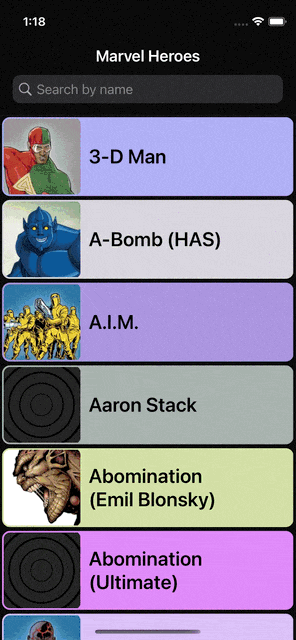

# Superheroes #

This is an iOS App created using Swift and the [Marvel API](https://developer.marvel.com/docs).
With this application you can see a list of Marvel heroes, searching them by name and see the list of comics where they have appeared. You can also mark your favorite heroes.

<p align="left">
  
</p>

## Requirements

* Xcode >= 13
* iOS >= 15.0
* Swift 5

## How to install
* Clone or download the project to your machine
* Modify the ApiKeys.swift file with your keys from the [MARVEL DEVELOPER ACCOUNT](https://developer.marvel.com/account) developer portal.
* Open XCode and build the project using: ```Cmd```+ ```Shift``` + ```B```.
* Run the Tests using: ```Cmd``` + ```U```.
* Run the App using: ```Cmd``` + ```R```.

## Architecture

* MvvM Design Pattern.
* UI developed 100% in code including the components.
* Communication between View and ViewModel is done through the use of Combine.
* View flow navigation is done by the use of the Coordinator pattern.
* The ViewModel gets data from the API by using: 
  * ApiResource: model which offers URL formed by the different components.
  * ApiProvider: application connector to an internet resource.
  * ApiError: Error wrapper for the application.

* Each feature splits on:
  * FeatureCoordinator
  * FeatureViewController
  * FeatureViewModel 
  * Components
  * Model

## Testing 88,6% coverage
* UnitTest:  offline, using mock data.
* UITest: online, main view flows and actions.
